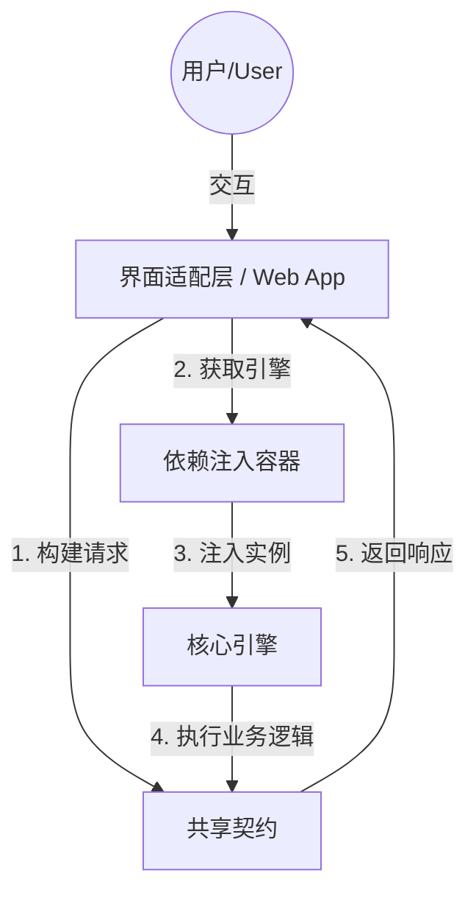

# 📘 AI 系统架构清单 (System Architecture Manifest)

## 1. 数据契约 (Data Contracts)
### 📦 模型: `AIRequest`
> Standardized Input Contract (No Implicit Arguments)

| 字段名 (Field) | 类型 (Type) | 描述 (Description) |
|---|---|---|
| `request_id` | <class 'str'> | - |
| `text_input` | <class 'str'> | - |
| `style_preset` | <class 'str'> | - |
| `use_rag_context` | <class 'bool'> | - |
| `ledger` | <class 'ai_system.src.shared.contracts.VisualLedger'> | - |

### 📦 模型: `AIResponse`
> Standardized Output Contract

| 字段名 (Field) | 类型 (Type) | 描述 (Description) |
|---|---|---|
| `request_id` | <class 'str'> | - |
| `assets` | List[ai_system.src.shared.contracts.SceneAsset] | - |
| `processing_time_ms` | <class 'float'> | - |
| `system_status` | <class 'str'> | - |

### 📦 模型: `GenerativeCornerstones`
> !!! abstract "Usage Documentation"
    [Models](../concepts/models.md)

A base class for creating Pydantic models.

Attributes:
    __class_vars__: The names of the class variables defined on the model.
    __private_attributes__: Metadata about the private attributes of the model.
    __signature__: The synthesized `__init__` [`Signature`][inspect.Signature] of the model.

    __pydantic_complete__: Whether model building is completed, or if there are still undefined fields.
    __pydantic_core_schema__: The core schema of the model.
    __pydantic_custom_init__: Whether the model has a custom `__init__` function.
    __pydantic_decorators__: Metadata containing the decorators defined on the model.
        This replaces `Model.__validators__` and `Model.__root_validators__` from Pydantic V1.
    __pydantic_generic_metadata__: Metadata for generic models; contains data used for a similar purpose to
        __args__, __origin__, __parameters__ in typing-module generics. May eventually be replaced by these.
    __pydantic_parent_namespace__: Parent namespace of the model, used for automatic rebuilding of models.
    __pydantic_post_init__: The name of the post-init method for the model, if defined.
    __pydantic_root_model__: Whether the model is a [`RootModel`][pydantic.root_model.RootModel].
    __pydantic_serializer__: The `pydantic-core` `SchemaSerializer` used to dump instances of the model.
    __pydantic_validator__: The `pydantic-core` `SchemaValidator` used to validate instances of the model.

    __pydantic_fields__: A dictionary of field names and their corresponding [`FieldInfo`][pydantic.fields.FieldInfo] objects.
    __pydantic_computed_fields__: A dictionary of computed field names and their corresponding [`ComputedFieldInfo`][pydantic.fields.ComputedFieldInfo] objects.

    __pydantic_extra__: A dictionary containing extra values, if [`extra`][pydantic.config.ConfigDict.extra]
        is set to `'allow'`.
    __pydantic_fields_set__: The names of fields explicitly set during instantiation.
    __pydantic_private__: Values of private attributes set on the model instance.

| 字段名 (Field) | 类型 (Type) | 描述 (Description) |
|---|---|---|
| `t2i_prompt` | <class 'str'> | - |
| `i2v_prompt` | <class 'str'> | - |
| `negative_prompt` | <class 'str'> | - |

### 📦 模型: `SceneAsset`
> !!! abstract "Usage Documentation"
    [Models](../concepts/models.md)

A base class for creating Pydantic models.

Attributes:
    __class_vars__: The names of the class variables defined on the model.
    __private_attributes__: Metadata about the private attributes of the model.
    __signature__: The synthesized `__init__` [`Signature`][inspect.Signature] of the model.

    __pydantic_complete__: Whether model building is completed, or if there are still undefined fields.
    __pydantic_core_schema__: The core schema of the model.
    __pydantic_custom_init__: Whether the model has a custom `__init__` function.
    __pydantic_decorators__: Metadata containing the decorators defined on the model.
        This replaces `Model.__validators__` and `Model.__root_validators__` from Pydantic V1.
    __pydantic_generic_metadata__: Metadata for generic models; contains data used for a similar purpose to
        __args__, __origin__, __parameters__ in typing-module generics. May eventually be replaced by these.
    __pydantic_parent_namespace__: Parent namespace of the model, used for automatic rebuilding of models.
    __pydantic_post_init__: The name of the post-init method for the model, if defined.
    __pydantic_root_model__: Whether the model is a [`RootModel`][pydantic.root_model.RootModel].
    __pydantic_serializer__: The `pydantic-core` `SchemaSerializer` used to dump instances of the model.
    __pydantic_validator__: The `pydantic-core` `SchemaValidator` used to validate instances of the model.

    __pydantic_fields__: A dictionary of field names and their corresponding [`FieldInfo`][pydantic.fields.FieldInfo] objects.
    __pydantic_computed_fields__: A dictionary of computed field names and their corresponding [`ComputedFieldInfo`][pydantic.fields.ComputedFieldInfo] objects.

    __pydantic_extra__: A dictionary containing extra values, if [`extra`][pydantic.config.ConfigDict.extra]
        is set to `'allow'`.
    __pydantic_fields_set__: The names of fields explicitly set during instantiation.
    __pydantic_private__: Values of private attributes set on the model instance.

| 字段名 (Field) | 类型 (Type) | 描述 (Description) |
|---|---|---|
| `scene_id` | <class 'str'> | - |
| `narrative` | Dict[str, str] | - |
| `generative_cornerstones` | <class 'ai_system.src.shared.contracts.GenerativeCornerstones'> | - |
| `state_update` | Optional[Dict[str, Any]] | - |
| `meta_data` | Dict[str, Any] | - |

### 📦 模型: `VisualLedger`
> Immutable snapshot of the character's visual state.

| 字段名 (Field) | 类型 (Type) | 描述 (Description) |
|---|---|---|
| `hero_ref_url` | <class 'str'> | The strict face reference URL |
| `physical_state` | <class 'str'> | Current body state (e.g., bleeding, muddy) |
| `outfit` | <class 'str'> | Description of current clothing |

## 2. 核心逻辑组件 (Core Logic)
### ⚙️ 组件: `AIEditorEngine`
**功能描述:**
The Pure Core Domain Logic.
Hexagonal Port: executes business logic based on AIRequest contract.

**公开方法 (Public Methods):**
- `def execute(req) -> AIResponse`
- `def get_gpu_status() -> str`

## 3. 架构数据流向 (Architecture Data Flow)
